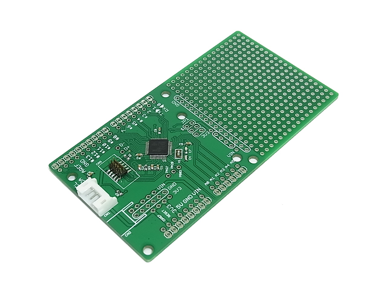
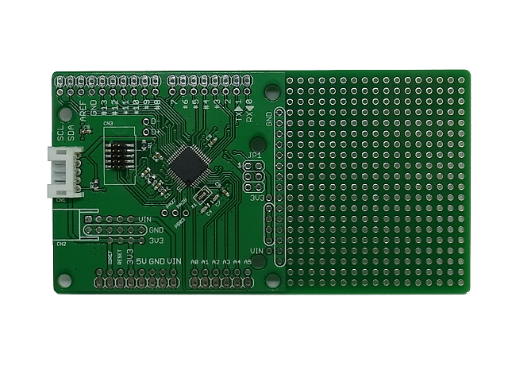

CC-samd21g Breakout Board
========================================

  
The CC-SAMD21 Breakout Board is breakout for the Atmel ATSAMD21G18 with prototyping area.  
This board shape is dirfferent from Arduino UNO or Zero, but it has Arduino Uno V3 style headers.  
There are only the minimal set of parts for running microcontroller. When you make your own circuit boards, this board might be helpful.

### Some highlights of the CC-samd21g Breakout Board:
 1. Main core: [ATSAMD21G18](http://www.atmel.com/devices/ATSAMD21G18A.aspx)
 2. Volatage regulator can be mounted in the extra prototyping area.
 3. Prototyping area 43.94mm(1730mil) x 53.34mm(2100mil)
 4. Measures 99.82mm(3930mil) x 53.34mm(2100mil)

Repository Contents
-------------------
* **/Hardware** - All Eagle design files (.brd, .sch)
* **/Software** - Software files for this hardware

Description(Pin Interfaces)
-------------------

### CN1 Pin Descriptions:
This connector is for Flashing a program microcontroller.
If you change BOOT MODE, To be selected BOOT MODE before connecting the power supply.  
And also, Communicate with SMA21G using "Serial" function.
- **VCC:** Restrictly 3.3VDC.
- **TX:** PB22 used as UART TX.
- **RX:** PB23 used as UART RX.
- **GND:** GND.
- **BOOT MODE:** Connected to "PA13" H:Flash boot(normally) L:UART download

If you are interested in more useful uart module, please see the [General Serial Communication Board](https://github.com/NaoNaoMe/General-Serial-Communication-Board).

### CN2 Pin Descriptions:
This connector is as power supply.
You can mount a voltage regulator in the extra prototyping area near the connector.
- **VIN:** Depending on the voltage regulator requirements.
- **GND:** GND.

How to burn bootloader and upload sketch
-------------------
See [this page](BurnBootloader.md)

License
-------------------
The repository is released under [Creative Commons ShareAlike 4.0 International](https://creativecommons.org/licenses/by-sa/4.0/).

Distributed as-is; no warranty is given.
